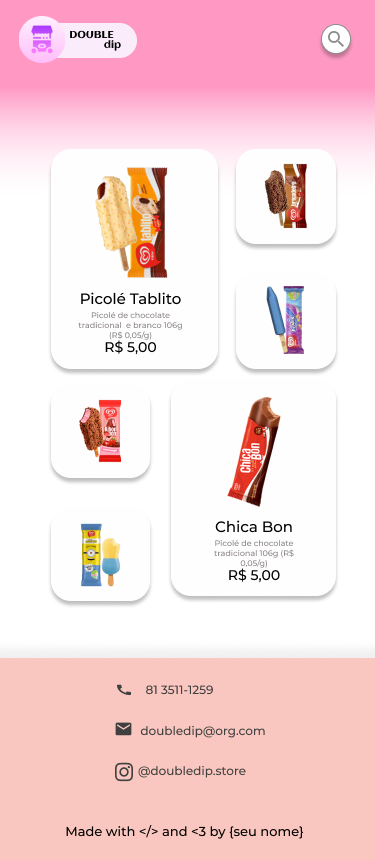

<!-- PROJECT LOGO -->
 

  

  <h3 align="center">Double Dip</h3>

  

This site was created during the selection process of the junior citi company. In this challenge, a mockup was given to develop the site in html and css.
     
    <a href="https://github.com/apfdamascena/double-dip"><strong>Explore the docs »</strong></a>
     
     
    ·
    <a href="https://github.com/apfdamascena/double-dip/issues">Report Bug</a>
    ·
    <a href="https://github.com/apfdamascena/double-dip/issues">Request Feature</a>
  

<!-- TABLE OF CONTENTS -->

  
<h2 style="display: inline-block">Table of Contents</h2>

  <ol>
    <li><a href="#contributors">Contributors</a></li>
    <li>
      <a href="#about-the-project">About The Project</a>
      <ul>
        <li><a href="#built-with">Built With</a></li>
      </ul>
    </li>
        <li><a href="#mockup">Mockup</a></li>
    <li><a href="#contact">Contact</a></li>
  </ol>

## Contributors

<table>
  <tr>
<td align="center"><a href="https://github.com/apfdamascena"> <b>Alex Damascena</b></a> </td>
</tr>
 </table>

## About The Project

During the company's junior city selection process, aspirants were encouraged to challenge themselves. With that, a development challenge was proposed by the development team. Given the mockup made in figma, we should replicate it in the web and mobile versions.

### Built With

* [ HTML ]( https://developer.mozilla.org/pt-BR/docs/Web/HTML )
* [ CSS ]( https://developer.mozilla.org/pt-BR/docs/Web/CSS )
* [ GRID ]( https://css-tricks.com/snippets/css/complete-guide-grid/ )
* [ FLEXBOX ]( https://css-tricks.com/snippets/css/a-guide-to-flexbox/ )

## Mockup

| | | |
|:-------------------------:|:-------------------------:|:-------------------------:|
|  Web |   Mobile

## Contact
- Alex Damsacena - apfd@cin.ufpe.br

<!-- MARKDOWN LINKS & IMAGES -->
<!-- https://www.markdownguide.org/basic-syntax/#reference-style-links -->
[contributors-shield]: https://img.shields.io/github/contributors/github_username/repo.svg?style=for-the-badge
[contributors-url]: https://github.com/github_username/repo/graphs/contributors
[forks-shield]: https://img.shields.io/github/forks/github_username/repo.svg?style=for-the-badge
[forks-url]: https://github.com/github_username/repo/network/members
[stars-shield]: https://img.shields.io/github/stars/github_username/repo.svg?style=for-the-badge
[stars-url]: https://github.com/github_username/repo/stargazers
[issues-shield]: https://img.shields.io/github/issues/github_username/repo.svg?style=for-the-badge
[issues-url]: https://github.com/github_username/repo/issues
[license-shield]: https://img.shields.io/github/license/github_username/repo.svg?style=for-the-badge
[license-url]: https://github.com/github_username/repo/blob/master/LICENSE.txt
[linkedin-shield]: https://img.shields.io/badge/-LinkedIn-black.svg?style=for-the-badge&logo=linkedin&colorB=555
[linkedin-url]: https://linkedin.com/in/github_username